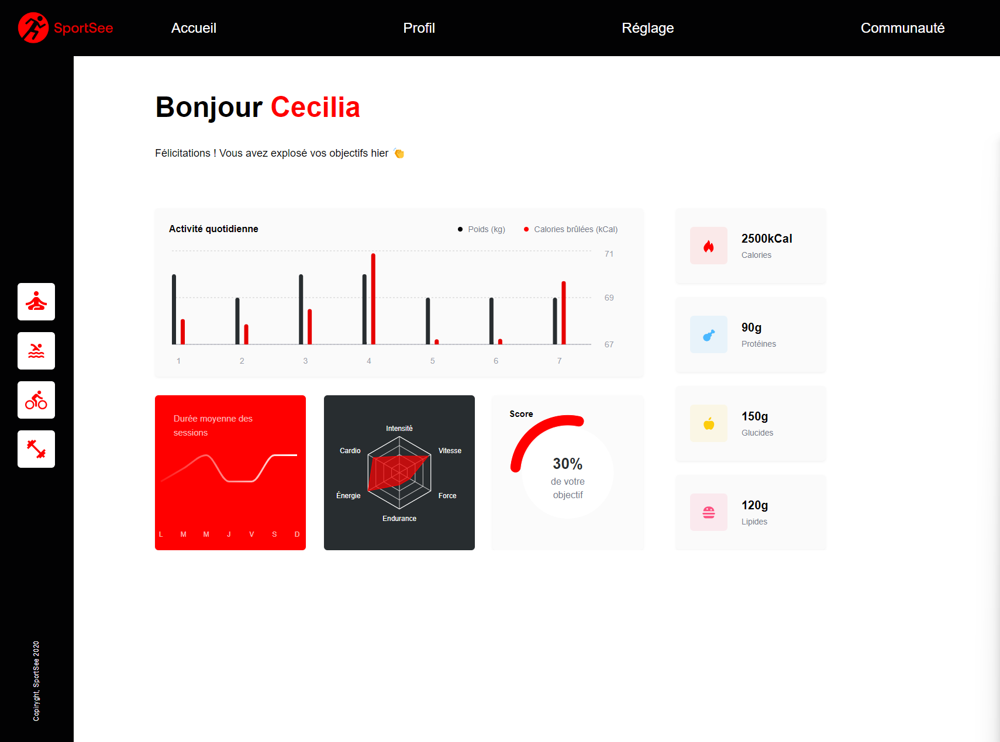

# Sport See

Project 12 from JavaScript React developper path at OpenClassrooms

<https://sportsee.saeros.fr/>

## Develop an analytics dashboard with React



## Figma Link

<https://www.figma.com/file/BMomGVZqLZb811mDMShpLu/UI-design-Sportify-FR?node-id=0%3A1>

## Kanban Link with user stories

<https://www.notion.so/Tableau-de-bord-SportSee-c41e6a0d918d4cecaa3e4b6f6853b61f?pvs=4>

## Description

This project is a React-based web application that utilizes an API to display user data, and also allows toggling between real API data and mocked data for development and testing purposes.

## Technologies and Tools Used

- Vite
- React
- React-router-dom
- Tailwindcss
- Node.js (backend)
- Recharts

## Installation and Setup

```bash
git clone https://github.com/rockethelll/P12-SportSee
cd P12-SportSee
npm install
npm run dev
```

connect to <http://localhost:5173>

## Launch the backend

Clone this repository : <https://github.com/OpenClassrooms-Student-Center/P9-front-end-dashboard>

```bash
cd P9-front-end-dashboard
yarn install
yarn dev
```

## How to switch between mocked data and API

- Go to /src/services/getData.js
- Uncomment the import you would like to use
- Comment the other import that won't be use
- Launch backend server
  (You'll receive an alert message when you use the API)
